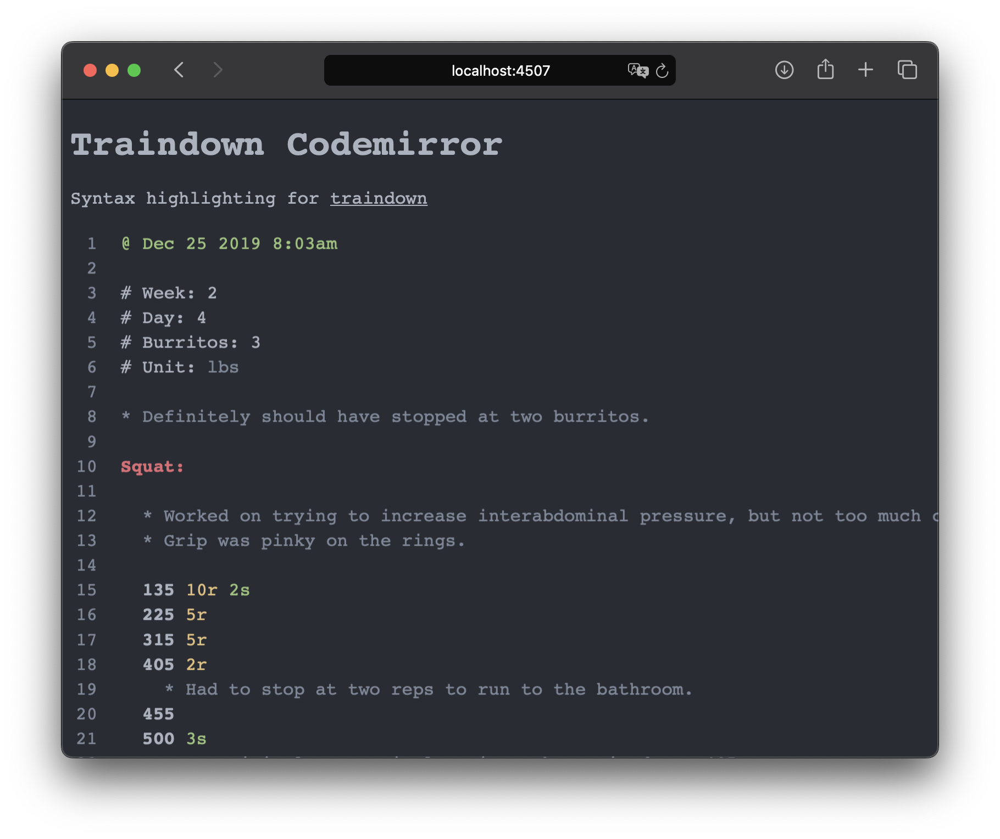

# Traindown Codemirror

[](https://jsr.io/@inro/lang-traindown) [](https://jsr.io/@inro/lang-traindown/score)

Syntax Highlighting for [traindown](https://traindown.com)

Check out the [example](https://inro-digital.github.io/lang-traindown/)



## Usage

| Platform | import command |
| --- | --- |
| deno | `deno add @inro/lang-traindown` |
| node | `npx jsr add @inro/lang-traindown` |
| yarn | `yarn dlx jsr add @inro/lang-traindown` |
| pnpm | `pnpm dlx jsr add @inro/lang-traindown` |
| bun | `bunx jsr add @inro/lang-traindown` |

```js
import { traindown } from "@inro/lang-traindown";
import { basicSetup, EditorView } from "codemirror"

const initialText = `@ 1/1/2020

* This is a Traindown scratch pad
* Practice your knowledge of Traindown!

# Good time?: YES

Squat: 500
`

new EditorView({
  extensions: [basicSetup, traindown(), oneDark],
  parent: document.body,
  doc: initialText
})
```
