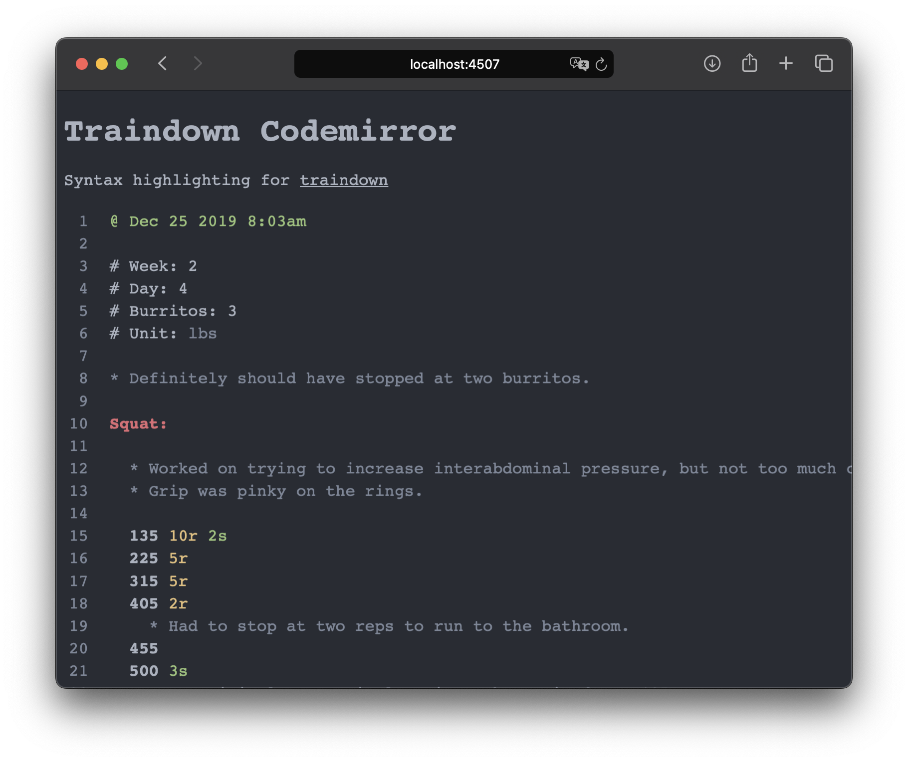

# Traindown Codemirror

[](https://jsr.io/@bpev/lang-traindown) [](https://jsr.io/@bpev/lang-traindown/score)

Syntax Highlighting for [traindown](https://traindown.com)

Check out the [example](https://inro-digital.github.io/lang-traindown/)



## Usage

| Platform | import command                          |
| -------- | --------------------------------------- |
| deno     | `deno add @bpev/lang-traindown`         |
| node     | `npx jsr add @bpev/lang-traindown`      |
| yarn     | `yarn dlx jsr add @bpev/lang-traindown` |
| pnpm     | `pnpm dlx jsr add @bpev/lang-traindown` |
| bun      | `bunx jsr add @bpev/lang-traindown`     |

```js
import { traindown } from '@bpev/lang-traindown'
import { basicSetup, EditorView } from 'codemirror'

const initialText = `@ 1/1/2020

* This is a Traindown scratch pad
* Practice your knowledge of Traindown!

# Good time?: YES

Squat: 500
`

new EditorView({
  extensions: [basicSetup, traindown(), oneDark],
  parent: document.body,
  doc: initialText,
})
```
